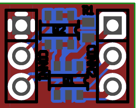

One-way 3-state level shifter
=============================

This is a design for a DIP breakout for a MOSFET-based unidirectional
level shifter with non-trivial output current capacity and low impedance
either sourcing or sinking. (This is possibly at a minor cost of some
speed and/or power consumption; other level shifters exist that are
probably a better fit if low current or high and/or asymmetrical
impedance isn't an issue.)

It consists of a complementary pair of MOSFETs in a single TSOP6
package, with the PMOS and NMOS acting as high- and low-side switches,
respectively. To allow the PMOS to be switched by a logic-level voltage,
an additional NMOS (also TSOP6) and a pull-up resistor (0603) are
included at its input.

The threshold voltages of the NMOSes determine the input logic high;
there is no pin corresponding to `Vdd` for the input side.

The nominal 100KΩ value for the pull-up reflects the switched voltage
for the original intended application, which is somewhere between 10V
and 20V. A smaller pull-up, such as 10KΩ, should be used if the voltage
is smaller (e.g. less than 10V). The tradeoff is speed versus power
usage: The high-side switch will take longer to shut off if the
resistance is higher; if it is lower, more current will be passed
through the pull-up when the high-side switch is on. If the application
circuit will be working with a variable voltage, consider how power
usage and timing are affected at the extremes.

The layout is substantively single-sided; the far side of the board is
just a ground fill and can be omitted.

*   Pins:
    *   Left side:
        *   `GND`
        *   `SW_HIGH` (active-high, turn on high-side switch)
        *   `SW_LOW` (active-high, turn on low-side switch)

    *   Right side:
        *   `VddB` (positive supply voltage for the output side)
        *   `OUT_HIGH` (output from the high-side switch)
        *   `OUT_LOW` (output from the low-side switch)

*   For the sake of being experimentation-friendly, `OUT_HIGH` and
    `OUT_LOW` are **not tied together**. The intention is that the
    outputs be either tied together or connected by a low-valued
    resistor (such as 100Ω).
*   The `SW_HIGH` and `SW_LOW` inputs are kept separate and
    independently control the high-side and low-side switches.
    *   When both inputs are low, the (intended) output is hi-Z (high
        impedance).
    *   Avoid setting both inputs high at once; this causes a
        "shoot-through" condition, basically a short circuit. The
        PTC-ness of the MOSFETs may mitigate this somewhat, but it has
        potential to cause damage.
    *   When switching from low to high or *vice versa*, consider
        allowing a short delay between turning one off and the other on.
        The turn-off for a MOSFET can be relatively slow, and
        transitioning too quickly may cause a brief "shoot-through".
        *   Depending on the ratings of the MOSFETs this may be
            acceptable; if the device's PTC behavior can be trusted to
            prevent any actual damage, the net result is merely spiking
            power consumption during transitions, not problematic as
            long as the switching frequency is kept low.
        *   Some variations of this design connect the high- and
            low-side outputs with a resistor in order to suppress this
            transitional spike. One of the two outputs is chosen as the
            actual output for the shifter, and the other has its output
            impedance increased by the value of the resistor. (For this
            reason, we'd like to see if tying the outputs together is a
            valid arrangement.)

As of this writing, I haven't fabricated this board yet. I can't give
any guarantee or even any indication that it is suitable for
manufacturing in its present state.

License
-------

The schematic and layout are to be used under the terms of the
OSI-approved MIT license, wherein the "Software" refers to these files.
The text follows:

> Copyright © 2014 Peter S. May
>
> Permission is hereby granted, free of charge, to any person obtaining
> a copy of this software and associated documentation files (the
> "Software"), to deal in the Software without restriction, including
> without limitation the rights to use, copy, modify, merge, publish,
> distribute, sublicense, and/or sell copies of the Software, and to
> permit persons to whom the Software is furnished to do so, subject to
> the following conditions:
>
> The above copyright notice and this permission notice shall be
> included in all copies or substantial portions of the Software.
>
> THE SOFTWARE IS PROVIDED "AS IS", WITHOUT WARRANTY OF ANY KIND,
> EXPRESS OR IMPLIED, INCLUDING BUT NOT LIMITED TO THE WARRANTIES OF
> MERCHANTABILITY, FITNESS FOR A PARTICULAR PURPOSE AND NONINFRINGEMENT.
> IN NO EVENT SHALL THE AUTHORS OR COPYRIGHT HOLDERS BE LIABLE FOR ANY
> CLAIM, DAMAGES OR OTHER LIABILITY, WHETHER IN AN ACTION OF CONTRACT,
> TORT OR OTHERWISE, ARISING FROM, OUT OF OR IN CONNECTION WITH THE
> SOFTWARE OR THE USE OR OTHER DEALINGS IN THE SOFTWARE.
